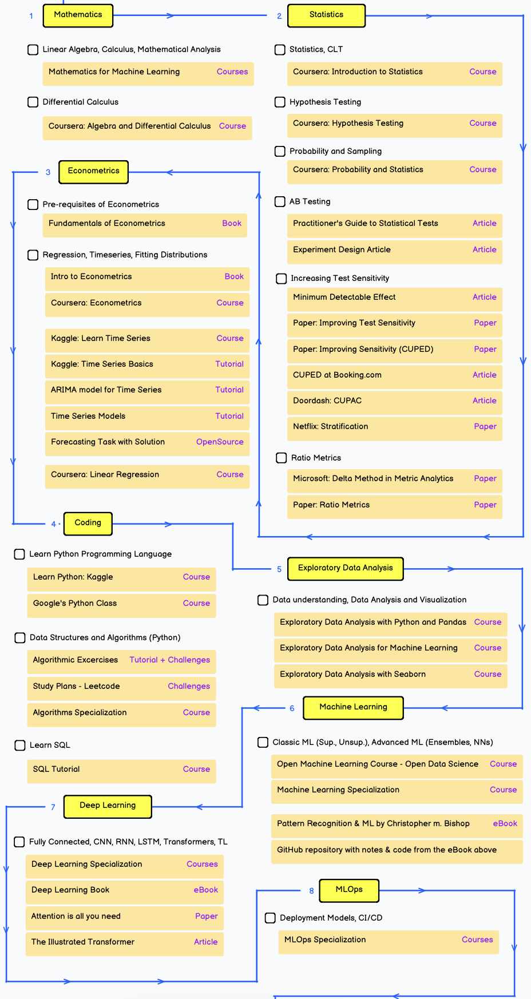

## Complete Data Science Roadmap

### List of Topics

1. [Python](Notes/Python/Index.md)
2. [Statistics](Stats.md)
3. [SQL](SQL.md)
4. [EDA And Feature Engineering And Feature Selection](EDA.md)
5. [Machine Learning](Notes/ML/Index.md)
6. [Deep Learning](DL.md)
7. [NLP](NLP.md)
8. [MLOps And Docker](Docker.md)
9. [GenAI](GenAI.md)
10. [Agentic AI](Agentic.md)

### [End-To-End Projects](Projects.md)

### [Reference Links](links/Resources.md)
