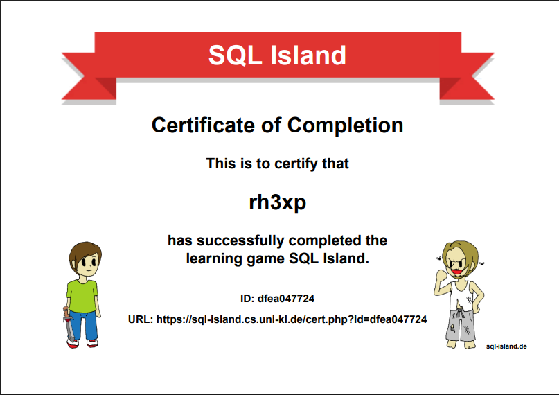

## [SQL Island](https://sql-island.informatik.uni-kl.de/)

After the survived plane crash, you will be stuck on SQL Island for the time being. 
By making progress in the game, you will find a way to escape from this island.

> Check my completion [certificate](https://sql-island.cs.uni-kl.de/cert.php?id=dfea047724) - 



#### SQL Commands Used  

> Show list of all villages

```sql
SELECT * 
FROM village
```

> Show list of all inhabitants

```sql
SELECT * 
FROM inhabitant
```

> Show list of all inhabitants which have job as butcher

```sql
SELECT * 
FROM inhabitant 
WHERE job = 'butcher';
```

> Show list of all inhabitants which are friendly

```sql
SELECT * 
FROM inhabitant 
WHERE state = 'friendly';
```

> Show list of all weaponsmiths which are friendly

```sql
SELECT *
FROM INHABITANT
WHERE state = 'friendly' AND job = 'weaponsmith';
```

> Show list of all smiths

```sql
SELECT *
FROM INHABITANT
WHERE state = 'friendly' AND job LIKE '%smith';
```

> Mayor registers Stranger into city

```sql
INSERT INTO inhabitant (name, villageid, gender, job, gold, state) 
VALUES ('Stranger', 1, '?', '?', 0, '?');
```

> Display personid of Stranger

```sql
SELECT personid
FROM inhabitant
WHERE name = 'Stranger';
```

> Display gold of Stranger 

```sql
SELECT gold
FROM inhabitant
WHERE personid = 20;
```

> Show list of items without any owner

```sql
SELECT *
FROM item
WHERE owner IS NULL;
```

> Update coffee cup ownership to Stranger  

```sql
UPDATE item 
SET owner = 20 
WHERE item = 'coffee cup';
```

> Update all owner-less items' ownership to Stranger  

```sql
UPDATE item 
SET owner = 20 
WHERE owner IS NULL;
```
> Show list of items owned by Stranger

```sql
SELECT * 
FROM item
WHERE owner = 20;
```

> Show list of friendly merchants & dealers

```sql
SELECT * 
FROM inhabitant
WHERE (job = 'dealer' OR job = 'merchant')
AND state = 'friendly';
```

> Sell ring & teapot to personid 15 

```sql
UPDATE item
SET owner = 15
WHERE item IN ('ring', 'teapot');
```

> Update gold qty for Stranger post selling items

```sql
UPDATE inhabitant 
SET gold = gold + 120 
WHERE personid = 20;
```

> Update name from Stranger to rh3xp

```sql
UPDATE inhabitant
SET name = 'rh3xp'
WHERE personid = 20;
```

> Show list of all bakers rich to poor

```sql
SELECT *
FROM inhabitant
WHERE job = 'baker'
ORDER BY gold desc;
```

> Earned 100 gold working for 8 hours as a baker, baking 10,000 breads

```sql
UPDATE inhabitant 
SET gold = gold + 100 - 150;
WHERE personid = 20;
```

> Sword acquired

```sql
INSERT INTO item (item, owner)
VALUES ('sword', 20);

```

> Show list of pilots

```sql
SELECT *
FROM inhabitant
WHERE job = 'pilot';
```

> Find where Dirty Dieter lives

```sql
SELECT village.name 
FROM village, inhabitant 
WHERE village.villageid = inhabitant.villageid 
AND inhabitant.name = 'Dirty Dieter';
```
> Find village chief name 

```sql
SELECT inhabitant.name
FROM village, inhabitant
ON village.villageid = inhabitant.villageid
WHERE village.name = 'Onionville'
AND village.chief = inhabitant.personid;
```

> Count of people in Onionville

```sql
SELECT COUNT(*) 
FROM inhabitant, village 
WHERE village.villageid = inhabitant.villageid 
AND village.name = 'Onionville'
```

> Count of females in Onionville

```sql
SELECT COUNT(*) 
FROM inhabitant, village 
WHERE village.villageid = inhabitant.villageid 
AND village.name = 'Onionville' 
AND inhabitant.gender = 'f';
```

> Find name of female in Onionville

```sql
SELECT inhabitant.name 
FROM inhabitant, village 
WHERE village.villageid = inhabitant.villageid 
AND village.name = 'Onionville' 
AND inhabitant.gender = 'f';
```

> Find sum of all gold in Cucumbertown town

```sql
SELECT SUM(inhabitant.gold) 
FROM inhabitant, village 
WHERE village.villageid = inhabitant.villageid 
AND village.name = 'Cucumbertown'
```

> Sum of all gold from bakers, dealers, merchants

```sql
SELECT sum(gold)
FROM inhabitant
WHERE job IN ('baker', 'dealer', 'merchant');
```

> Find AVG, Total gold distribution based on job

```sql
SELECT job, SUM(inhabitant.gold), AVG(inhabitant.gold) 
FROM inhabitant 
GROUP BY job 
ORDER BY AVG(inhabitant.gold)
```

> Find AVG, Total gold distribution based on state

```sql
SELECT state, AVG(gold)
FROM inhabitant
GROUP BY state;
```

> KILL DIETER !!!

```sql
DELETE FROM inhabitant 
WHERE name = 'Dirty Dieter';
```

>  KILL DIANE !!!

```sql
DELETE FROM INHABITANT
WHERE name = 'Dirty Diane';
```

> Set pilot FREE !!!

```sql
UPDATE inhabitant
SET state = 'friendly'
WHERE job = 'pilot';
```

> I AM FREEEEEEEE !!!

```sql
UPDATE inhabitant 
SET state = 'emigrated' 
WHERE personid = 20;
```
